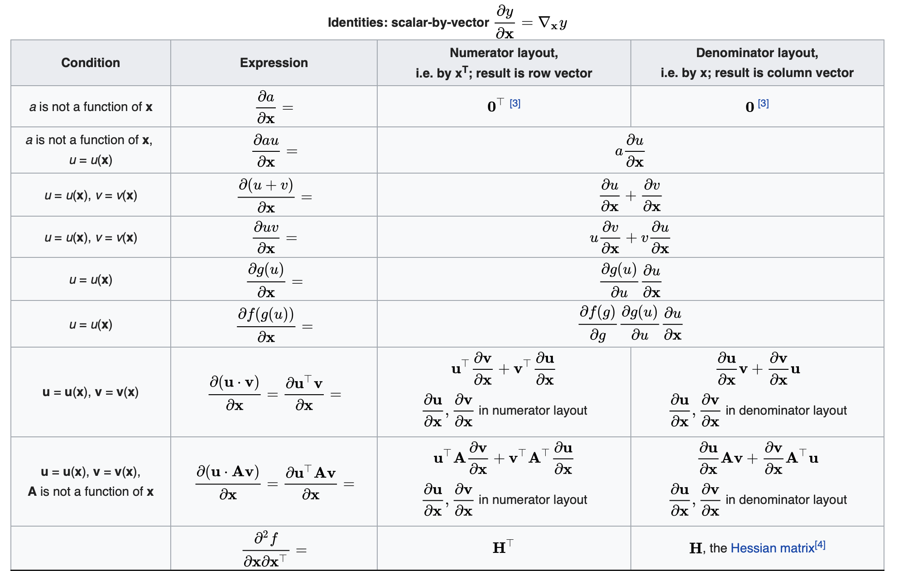
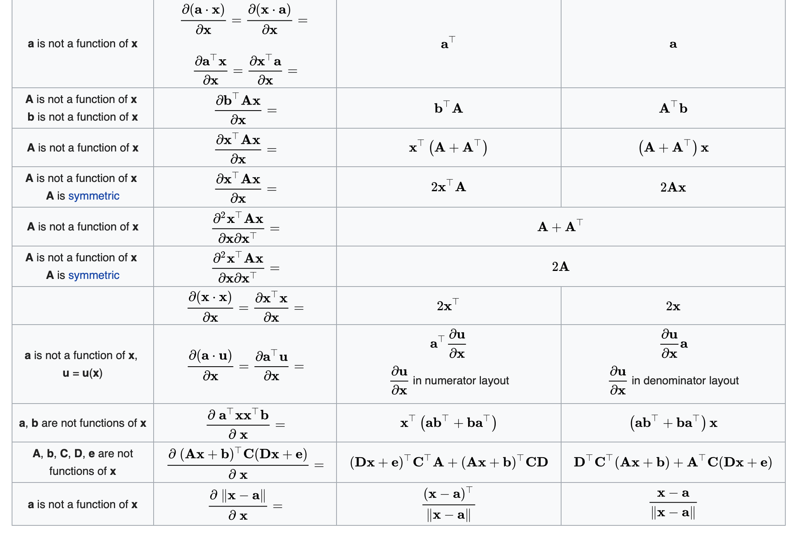
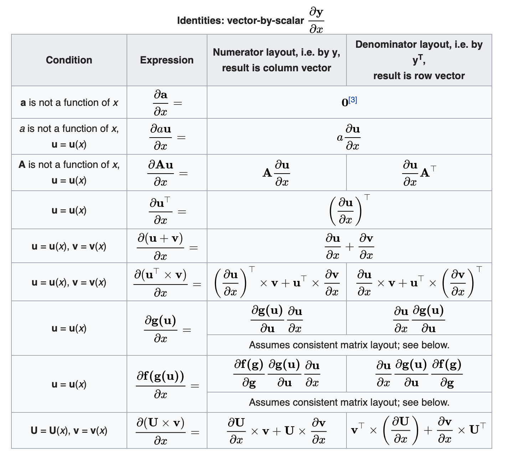
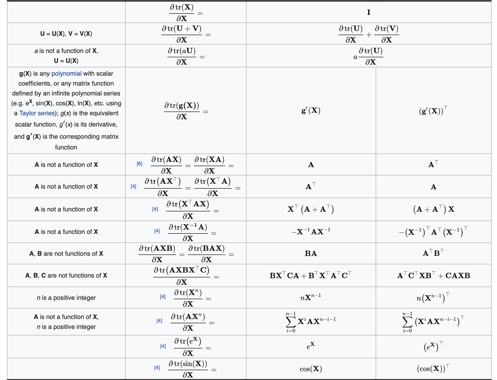
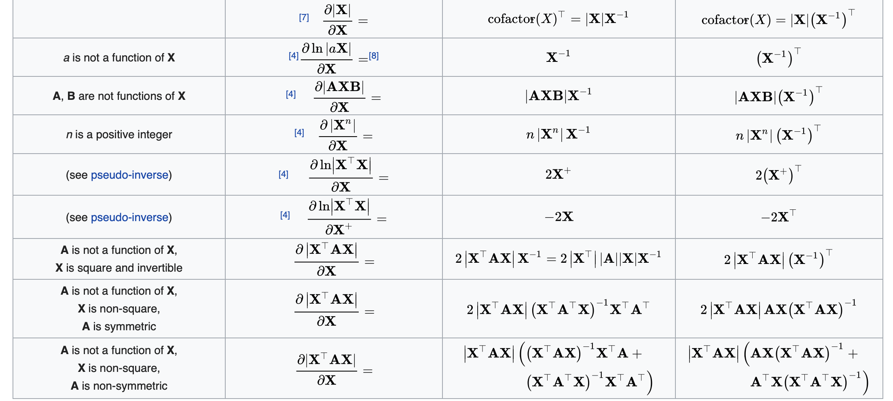
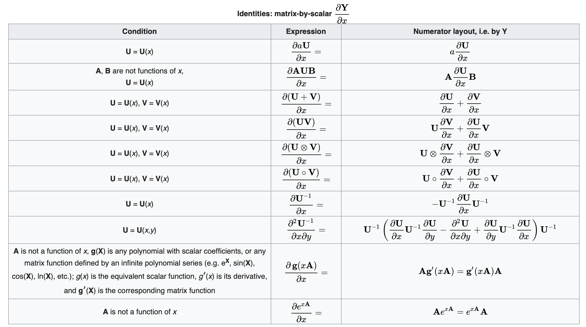
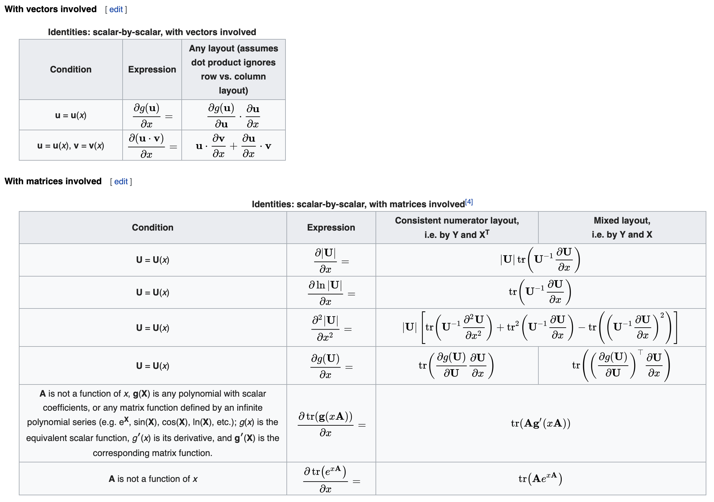

* content
{:toc}

## 说明
本文大部分内容翻译自[Matrix calculus](https://en.wikipedia.org/wiki/Matrix_calculus)，部分结合自身的理解。

简单来说，矩阵求导就是分别将各元素进行求导，然后将求导的结果写成矩阵的形式（向量为矩阵特殊形式），根据写成的矩阵的排列方式，又分为分子布局和分母布局。

* 分子布局：行数和分子相同的维度，列数和分母相同的维度。如列向量对列向量的导数为分子各元素分别对分母各元素的导数，然后将结果排列为矩阵，矩阵的行数为分子的行数，矩阵的列数为分母的行数
* 分母布局：行数和分母相同的维度，列数和分子相同的维度。如列向量对列向量的导数为分子各元素分别对分母各元素的导数，然后将结果排列为矩阵，矩阵的行数为分母的行数，矩阵的列数为分子的行数
* 混合布局：向量或者矩阵在分子时采用分子布局，向量或矩阵在分母时采用分母布局。

布局方式详细参见[Layout conventions](https://en.wikipedia.org/wiki/Matrix_calculus#Layout_conventions)，不同的文章可能使用不同的布局方式，如在深度学习的领域中，如在优化算法中需要计算$\boldsymbol{W}-\alpha\frac{\partial{L}}{\boldsymbol{W}}$时，为了保证维度相容，就采用的是分母布局或混合布局。无需纠结，最终只是在求导结果中相差个转置，其实只要保证求导的结果矩阵维度相容，一般就没有问题，本文采用分子布局。

向量和矩阵之间，矩阵和矩阵之间的导数涉及到三维、四维张量，这里暂不考虑这种导数。

## 符号说明
我们使用$M(n,m)$表示包含$n$行$m$列的$n*m$实矩阵的空间，该空间中的一般矩阵用粗体大写字母表示，如$\boldsymbol{A,X,Y}$等，

而若该矩阵属于$M(n,1)$，即列向量，则用粗体小写字母表示，如$\boldsymbol{a,x,y}$等，不做特别说明的话，向量默认为列向量，

特别地，$M(1,1)$空间中的元素为标量，用小些斜体字母表示，如$a,x,y$等。

通常使用字母表的前半部分$(a,b,c,\cdots)$用于表示常量，字母表的后半部分$(x,y,z,\cdots)$表示变量。
* 标量$a,b,c,d,e$为常量，标量$u,v$为$x$、$\boldsymbol{x}$或$\boldsymbol{X}$的函数
* 向量$\boldsymbol{a},\boldsymbol{b},\boldsymbol{c},\boldsymbol{d},\boldsymbol{e}$为常向量，向量$\boldsymbol{u},\boldsymbol{v}$为$x$、$\boldsymbol{x}$或$\boldsymbol{X}$的函数
* 矩阵$\boldsymbol{A},\boldsymbol{B},\boldsymbol{C},\boldsymbol{D},\boldsymbol{E}$为常矩阵，矩阵$\boldsymbol{U},\boldsymbol{V}$为$x$、$\boldsymbol{x}$或$\boldsymbol{X}$的函数

矩阵的转置：$\boldsymbol{X}^{\mathrm{T}}$，矩阵的迹：$\text{tr}(\boldsymbol{X})$，矩阵的行列式：$\text{det}(\boldsymbol{X})$或$\|\boldsymbol{X}\|$，矩阵的范数：$\|\|\boldsymbol{X}\|\|$。

## 向量求导定义
向量可以看作只有一列的矩阵，是矩阵求导的特殊情况

### 向量对标量求导定义
向量$\boldsymbol{y}=[y_1,y_2,\cdots,y_m]^{\mathrm{T}}$对标量$x$的导数写成如下形式：

$$
\frac{\partial{\boldsymbol{y}}}{\partial{x}} = [\frac{\partial{y_1}}{\partial{x}},\frac{\partial{y_2}}{\partial{x}},\cdots,\frac{\partial{y_m}}{\partial{x}}]^{\mathrm{T}}
$$

即：

$$(\frac{\partial{\boldsymbol{y}}}{\partial{x}})_i = \frac{\partial{y_i}}{\partial{x}}$$

### 标量对向量求导定义
标量$y$对向量$\boldsymbol{x}^{\textrm{T}}=[x_1,x_2,\cdots,x_n]$对的导数写成如下形式：

$$
\frac{\partial{y}}{\partial{\boldsymbol{x}^\textrm{T}}} = [\frac{\partial{y}}{\partial{x_1}},\frac{\partial{y}}{\partial{x_2}},\cdots,\frac{\partial{y}}{\partial{x_n}}]^{\textrm{T}}
$$

即：

$$(\frac{\partial{y}}{\partial{\boldsymbol{x}^{\textrm{T}}}})_i = \frac{\partial{y}}{\partial{x_i}}$$

### 向量对向量求导定义
向量$\boldsymbol{y}=[y_1,y_2,\cdots,y_m]^{\mathrm{T}}$对向量$\boldsymbol{x}=[x_1,x_2,\cdots,x_n]^{\mathrm{T}}$对的导数写成如下形式：

$$
\frac{\partial{\boldsymbol{y}}}{\partial{\boldsymbol{x}}} = 

\left[
\begin{matrix}
 \frac{\partial{y_1}}{\partial{x_1}} & \frac{\partial{y_1}}{\partial{x_2}}      & \cdots & \frac{\partial{y_1}}{\partial{x_n}}      \\
 \frac{\partial{y_2}}{\partial{x_1}}     &\frac{\partial{y_2}}{\partial{x_2}}    & \cdots & \frac{\partial{y_2}}{\partial{x_n}}      \\
 \vdots & \vdots & \ddots & \vdots \\
 \frac{\partial{y_m}}{\partial{x_1}}     &\frac{\partial{y_m}}{\partial{x_2}}      & \cdots &\frac{\partial{y_m}}{\partial{x_n}}      \\
\end{matrix}
\right]

$$

为$m*n$维矩阵，也叫做雅可比矩阵。即：

$$(\frac{\partial{\boldsymbol{y}}}{\partial{\boldsymbol{x}}})_{ij} = \frac{\partial{y_i}}{\partial{x_j}}$$

## 矩阵求导定义
### 矩阵对标量求导定义
矩阵$\boldsymbol{Y}$对标量$x$的导数定义如下：

$$
\frac{\partial{\boldsymbol{Y}}}{\partial{x}} = 

\left[
\begin{matrix}
 \frac{\partial{y_{11}}}{\partial{x}} & \frac{\partial{y_{12}}}{\partial{x}}      & \cdots & \frac{\partial{y_{1n}}}{\partial{x}}      \\
 \frac{\partial{y_{21}}}{\partial{x}}     &\frac{\partial{y_{22}}}{\partial{x}}    & \cdots & \frac{\partial{y_{2n}}}{\partial{x}}      \\
 \vdots & \vdots & \ddots & \vdots \\
 \frac{\partial{y_{m1}}}{\partial{x}}     &\frac{\partial{y_{m2}}}{\partial{x}}      & \cdots &\frac{\partial{y_{mn}}}{\partial{x}}      \\
\end{matrix}
\right]

$$

即：

$$(\frac{\partial{\boldsymbol{Y}}}{\partial{x}})_{ij} = \frac{\partial{y_{ij}}}{\partial{x}}$$

### 标量对矩阵求导定义
标量$y$对矩阵$\boldsymbol{X}$的导数定义如下：

$$
\frac{\partial{y}}{\partial{\boldsymbol{X}}} = 

\left[
\begin{matrix}
 \frac{\partial{y}}{\partial{x_{11}}} & \frac{\partial{y}}{\partial{x_{21}}}      & \cdots & \frac{\partial{y}}{\partial{x_{p1}}}      \\
 \frac{\partial{y}}{\partial{x_{12}}}     &\frac{\partial{y}}{\partial{x_{22}}}    & \cdots & \frac{\partial{y}}{\partial{x_{p2}}}      \\
 \vdots & \vdots & \ddots & \vdots \\
 \frac{\partial{y}}{\partial{x_{1q}}}     &\frac{\partial{y}}{\partial{x_{2q}}}      & \cdots &\frac{\partial{y}}{\partial{x_{pq}}}      \\
\end{matrix}
\right]

$$

即：

$$(\frac{\partial{y}}{\partial{\boldsymbol{X}}})_{ij} = \frac{\partial{y}}{\partial{x_{ji}}}$$

## 求导法则
在微分、求导过程中，有三条法则非常重要，在矩阵的微分、求导过程中也同样重要。
* 链式法则：如果$y = f(g(x))$，则$y^\prime(x) = f^\prime(g(x))g^\prime(x)$
* 乘积法则：$(fg)^\prime = f^\prime g+fg^\prime$
* 求和法则：$(f+g)^\prime = f^\prime + g^\prime$

求和法则是通用的，由于矩阵乘积不是可交换的，所以乘积法则需要注意顺序。链式法则在矩阵对标量和标量对矩阵求导时不适用（这个情况下，一般使用迹运算）。

## 一些恒等式
### 常用等式

$$||\boldsymbol{X}||^2 = \mathrm{tr}(\boldsymbol{X}^\mathrm{T}\cdot\boldsymbol{X}) = \mathrm{tr}(\boldsymbol{X}\cdot\boldsymbol{X}^\mathrm{T})$$

$$
\mathrm{tr(\boldsymbol{A}\boldsymbol{B}\boldsymbol{C}\boldsymbol{D})}
 = \mathrm{tr(\boldsymbol{B}\boldsymbol{C}\boldsymbol{D}\boldsymbol{A})}
 = \mathrm{tr(\boldsymbol{C}\boldsymbol{D}\boldsymbol{A}\boldsymbol{B})}
 = \mathrm{tr(\boldsymbol{D}\boldsymbol{A}\boldsymbol{B}\boldsymbol{C})}
$$

### 转置
由上述的向量、矩阵的导数定义，易知：

$$
\frac{\partial{y^\mathrm{T}}}{\partial{x}} = \frac{\partial{y}}{\partial{x^\mathrm{T}}} = (\frac{\partial{y}}{\partial{x}})^{\mathrm{T}}
$$

其中$x,y$为满足上述定义的标量、向量或矩阵。

### 向量对向量求导恒等式

根据上面的定义和求导法则，很容易推导上述结果，下面选择一个进行推导证明：

$$
\begin{aligned}
(\frac{\partial{v\boldsymbol{u}}}{\partial{\boldsymbol{x}}})_{ij} &= \frac{\partial{vu_i}}{\partial{x_j}} \\
&= v\frac{\partial{u_i}}{\partial{x_j}}+\frac{\partial{v}}{\partial{x_j}}u_i \\
& = v\frac{\partial{u_i}}{\partial{x_j}}+u_i\frac{\partial{v}}{\partial{x_j}} \\
&= v(\frac{\partial{\boldsymbol{u}}}{\partial{\boldsymbol{x}}})_{ij} +
(\boldsymbol{u}\frac{\partial{v}}{\partial{\boldsymbol{x}}})_{ij}\\

\Rightarrow \frac{\partial{v\boldsymbol{u}}}{\partial{\boldsymbol{x}}} &= v\frac{\partial{\boldsymbol{u}}}{\partial{\boldsymbol{x}}} +
\boldsymbol{u}\frac{\partial{v}}{\partial{\boldsymbol{x}}} \\
\end{aligned}
$$

### 标量对向量求导恒等式

### 向量对标量求导恒等式

### 标量对矩阵求导恒等式

这里选择几个进行证明：

$$
\begin{aligned}
\frac{\partial{(\boldsymbol{X}\boldsymbol{a}+\boldsymbol{b})^\mathrm{T}\boldsymbol{C}(\boldsymbol{X}\boldsymbol{a}+\boldsymbol{b})}}{\partial{\boldsymbol{X}}} &= \frac{\partial{\mathrm{tr}((\boldsymbol{X}\boldsymbol{a}+\boldsymbol{b})^\mathrm{T}\boldsymbol{C}(\boldsymbol{X}\boldsymbol{a}+\boldsymbol{b}))}}{\partial{\boldsymbol{X}}} \\
& = \frac{\partial{\mathrm{tr}((\boldsymbol{X}\boldsymbol{a}+\boldsymbol{b})^\mathrm{T}\boldsymbol{C}(\boldsymbol{X_1}\boldsymbol{a}+\boldsymbol{b}))}}{\partial{\boldsymbol{X_1}}}+\frac{\partial{\mathrm{tr}((\boldsymbol{X_2}\boldsymbol{a}+\boldsymbol{b})^\mathrm{T}\boldsymbol{C}(\boldsymbol{X}\boldsymbol{a}+\boldsymbol{b}))}}{\partial{\boldsymbol{X_2}}}\\
& = \frac{\partial{\mathrm{tr}((\boldsymbol{X}\boldsymbol{a}+\boldsymbol{b})^\mathrm{T}\boldsymbol{C}\boldsymbol{X_1}\boldsymbol{a})}}{\partial{\boldsymbol{X_1}}}+\frac{\partial{\mathrm{tr}((\boldsymbol{X_2}\boldsymbol{a})^\mathrm{T}\boldsymbol{C}(\boldsymbol{X}\boldsymbol{a}+\boldsymbol{b}))}}{\partial{\boldsymbol{X_2}}}\\
&=\boldsymbol{a}(\boldsymbol{X}\boldsymbol{a}+\boldsymbol{b})^\mathrm{T}\boldsymbol{C}+(\boldsymbol{C}(\boldsymbol{X}\boldsymbol{a}+\boldsymbol{b})\boldsymbol{a}^\mathrm{T})^\mathrm{T}\\
&=\boldsymbol{a}(\boldsymbol{X}\boldsymbol{a}+\boldsymbol{b})^\mathrm{T}(\boldsymbol{C}+\boldsymbol{C}^\mathrm{T})
\end{aligned} \\

\blacksquare

$$

$$
\begin{aligned}
f = \frac{\partial{\mathrm{tr}(\mathrm{\boldsymbol{X}^{-1}\boldsymbol{A})}}}{\partial{\boldsymbol{X}}} &=  \frac{\partial{\mathrm{tr}(\boldsymbol{X}^{-1}\boldsymbol{X}\boldsymbol{X}^{-1}\boldsymbol{A})}}{\partial{\boldsymbol{X}}} \\
&= \frac{\partial{\mathrm{tr}(\boldsymbol{X}^{-1}_1\boldsymbol{X}\boldsymbol{X}^{-1}\boldsymbol{A})}}{\partial{\boldsymbol{X}_1}} +\frac{\partial{\mathrm{tr}(\boldsymbol{X}^{-1}\boldsymbol{X}_2\boldsymbol{X}^{-1}\boldsymbol{A})}}{\partial{\boldsymbol{X}_2}} +\frac{\partial{\mathrm{tr}(\boldsymbol{X}^{-1}\boldsymbol{X}\boldsymbol{X}^{-1}_3\boldsymbol{A})}}{\partial{\boldsymbol{X}}_3} \\
&=f + \boldsymbol{X}^{-1}\boldsymbol{A}\boldsymbol{X}^{-1} + f \\

\Rightarrow f &=-\boldsymbol{X}^{-1}\boldsymbol{A}\boldsymbol{X}^{-1}
\end{aligned}\\

\blacksquare

$$

$$
\begin{aligned}
|\boldsymbol{X}|\boldsymbol{I} = \mathrm{adj}(\boldsymbol{X})\boldsymbol{X}
\Rightarrow  &|\boldsymbol{X}| = \sum_{j}\mathrm{adj}(\boldsymbol{X})_{ij}\boldsymbol{X}_{ji}   \qquad \forall i \\
\Rightarrow & (\frac{\partial|\boldsymbol{X}|}{\partial{\boldsymbol{X}}})_{ij} = \frac{\partial|\boldsymbol{X}|}{\partial{\boldsymbol{X}}_{ji}} = \mathrm{adj}(\boldsymbol{X})_{ij} \\
\Rightarrow & \frac{\partial|\boldsymbol{X}|}{\partial{\boldsymbol{X}}} = \mathrm{adj}(\boldsymbol{X}) = |\boldsymbol{X}|\boldsymbol{X}^{-1}
\end{aligned} \\

\blacksquare

$$

上面证明过程中用到了伴随矩阵的性质，伴随矩阵的第$i$行对应的是代数余子式的第$i$列，而代数余子式的第$i$列的元素必定去掉了元素$\boldsymbol{X}$的第$i$列，也就是说伴随矩阵的第$i$行元素全部与$\boldsymbol{X}_{ji}$无关。关于伴随矩阵的具体性质可以参见[Adjugate matrix](https://en.wikipedia.org/wiki/Adjugate_matrix)。

其他大部分证明过程类似，或者用了类似的思想，这里由于敲公式太累了，也没有这么多时间，就不一一放出证明过程了。

### 矩阵对标量求导恒等式

### 标量对标量求导恒等式

