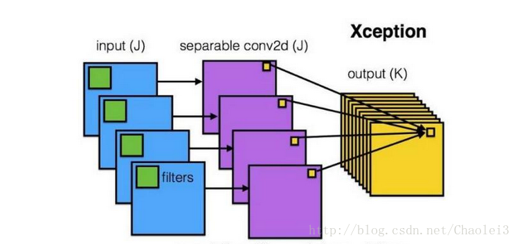
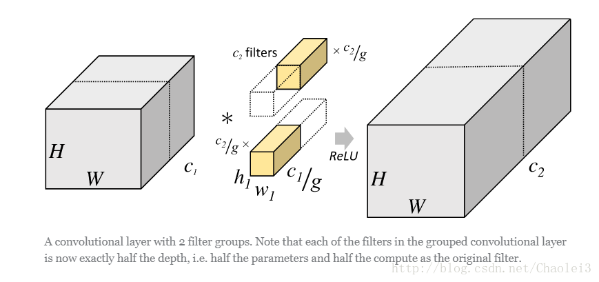

* content
{:toc}

## 几种常见的卷积方法
### 数学中的卷积
为满足结合律，先**翻转**后“卷积”

### 机器学习中的“卷积”
相比于数学中定义的卷积操作，机器学习中的卷积省略了**翻转**这一过程  
> 详见[如何理解卷积神经网络中的权值共享](https://www.zhihu.com/question/47158818/answer/670431317)  

卷积神经网络两大核心思想：
1. **网络局部连接(Local Connectivity)**  
   对比全连接网络：不使用局部连接，即每个元素单元与隐藏层的神经元进行全连接，参数量大大增加
2. **卷积核参数共享(Parameter Sharing)**  
   一个$m*m$的卷积核在图像上扫描，进行特征提取，$k$个channels下参数总量为$m*m*k$  
   对比[local conv](#localconv)：不使用参数共享，卷积核每滑动一次，卷积核中的权重参数均发生改变，参数量大大增加  

### local卷积(local conv)
> 参考至FaceBook的DeepFace网络([博客](https://blog.csdn.net/stdcoutzyx/article/details/46776415))

**思想**：
- 相比于机器学习中的卷积操作，Local-Conv的卷积核参数不共享。

**好处**：  
- 对齐的人脸图片中，不同的区域会有不同的统计特征，卷积的局部稳定性假设并不存在，所以使用相同的卷积核会导致信息的丢失
- 不共享的卷积核并不增加抽取特征时的计算量，而会增加训练时的计算量
- 使用不共享的卷积核，需要训练的参数量大大增加，因而需要很大的数据量，然而这个条件本文刚好满足。    

**应用**：
- [DeepFace](###DeepFace)

### 空洞卷积
> 参考至：  
> [对几种常见卷积的简单理解](https://blog.csdn.net/blateyang/article/details/84640259)  
> [CNN 中千奇百怪的卷积方式大汇总](https://www.leiphone.com/news/201709/AzBc9Sg44fs57hyY.html)  
> [CNN中几个新的卷积方式](https://zhuanlan.zhihu.com/p/54033473)

**思想**：
- 将卷积核进行“扩张”（拉大间距产生空洞，产生的空洞weight以0值填充，有一个扩张率参数d，可理解成有效卷积点间的距离）  

**好处**：
- 在不增加卷积核参数量的前提下或者不进行下采样的条件下有效扩大感受野，在图像需要全局信息的问题中，能够很好的应用dilated conv

### 深度可分离卷积(Depthwise separable convolution)

**思想**：
- 先逐通道地(depthwise)对输入数据体空间域做卷积，再沿着通道方向做1*1卷积进行通道融合    

**好处**：
- 将通道和空间区域进行解耦分离；
- 有效降低参数量(e.g 卷积权重参数$k*k*Ci*Co->k*k*Ci+1*1*Ci*Co$)   

**应用**：
- [InceptionNet](###InceptionNet)
- [MobileNet](###MobileNet)
- [MobileNet](###MobileNet)
- [MobileNet](###MobileNet)

### 分组卷积
    
**思想**：
- 将输入数据体沿通道维度分成多组，对每组分别进行卷积，然后再将各组卷积的输出连接(concatenate)起来

**好处**：
- 同样可有效降低参数量(e.g 卷积权重参数$k*k*Ci*Co->k*k*Ci*Co/g$ 分成g组)
- 可在通道维度学习block-diagonal结构的稀疏性，使得网络中高相关的滤波器能够以一种更加结构化的方式被学习到，不容易过拟合，起到类似正则化的效果([链接](https://blog.yani.io/filter-group-tutorial/))

**应用**：
- 待补充
