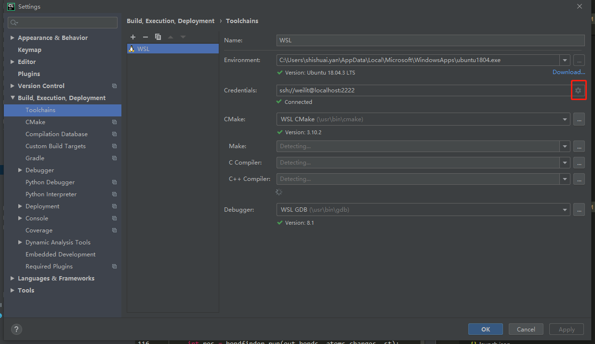
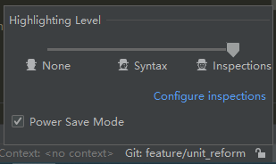

* content
{:toc}

# WSL(Windows Subsystem for Linux)使用笔记
> 参考：[WSL(Windows Subsystem for Linux)的安装与使用](https://www.jianshu.com/p/1da2ef53497e)

## 安装
1. 控制面板->程序和功能->启用或关闭Windows功能->勾选 适用于Linux的Windows子系统
2. 重启电脑
3. 打开应用商城搜索“WSL”，可根据自己需求选择安装一个或多个Linux系统
4. 安装完成后可在开始菜单里找到快捷方式并启动，第一次运行需要等待安装并设置用户名、密码


## 打开wsl
- 开始菜单找到快捷方式
- cmd中输入`wsl`或`bash`
- cmd中输入`wsl [command]`或`bash -c [command]`
- Linux系统名称.exe（如：`ununtu1804.exe`）
其中，前两种方式会运行默认的linux系统，当你安装多个linux系统之后可以使用wslconfig来指定

## 第一次登陆(与正常linux系统相同)
- 第一次登陆wsl需要设置用户名和密码，此时设置的是普通用户
- 为了进入root模式，由于当前未设置root密码，需要在命令行执行`sudo passwd`，并输入上一步设置的普通用户密码，即可设置root密码
- 此时再使用`su`即可进入root用户
- 切换普通用户：`su [user_name]`

## 使用wslconfig命令进行管理(cmd)
1. 设置默认运行的linux系统  
   `wslconfig /setdefault <DistributionName>`  
2. 卸载linux系统  
   `wslconfig /unregister <DistributionName>`  
3. 查看已安装linux系统  
   `wslconfig /list`

## 配置ssh
1. 检查是否安装ssh-server  
   `dpkg -l | grep ssh`
2. 未安装则安装openssh-server  
   `sudo apt install openssh-server`  
3. 修改ssh配置文件  
   `sudo vim /etc/ssh/sshd_config`  
   ```bash
    # 找到并修改如下两行
    # 为了避免与windows的ssh服务冲突，这里端口务必修改
    Port 2222 
    # 登陆验证
    PasswordAuthentication yes
   ```
4. 重启ssh服务  
   `sudo service ssh --full-restart`

至此，wsl上的ssh已配置完成，可使用`ssh user_name@localhost -p 2222`在cmd中通过ssh连接wsl。  
注意：
- 每次开机或重启wsl都需要手动启动ssh服务，命令如下：  
  `sudo service ssh start`  
- 上述操作均在普通用户下进行，ubuntu的root用户默认不允许使用ssh连接，需要额外配置
- TODO：ssh开机自启动

## 重启wsl
方法一：
- 关闭当前打开的所有wsl的bash窗口
方法二：wsl子系统是基于LxssManager系统运行的，只需要将LxssManager重启即可
- 创建一个bat文件并写入如下内容
```bash
net stop LxssManager
net start LxssManager
```
- 双击该文件即可强制关闭wsl并重启

## 设置默认登陆用户(cmd)
当我们运行`wsl`时，它会用第一次运行时输入的用户名登陆，如果想改为其他用户，可以在cmd中输入以下命令（以ubuntu-18.04为例）：  
`ubuntu1804 config --default-user root`  
这样，以后再运行ubuntu它就会默认以root登陆。此外还可以“ubuntu /?”查看其更多使用方法。

## wsl文件系统与本地文件系统互相访问
1. wsl中访问本地文件  
   在`/mnt`目录下有c,d,e等文件夹，分别对应本地的C盘，D盘，E盘
2. 本地访问wsl根目录  
微软强烈不建议在外部对WSL文件系统进行更改，所以未公开WSL所在的根目录  
`(C:\Users\XXXX\AppData\Local\Packages\CanonicalGroupLimited.UbuntuonWindows_79rhkp1fndgsc\LocalState\rootfs)`

## CLion + WSL环境配置
参考[window下jetBrains Clion使用wsl安装配置 c++开发神器](https://blog.csdn.net/u010606602/article/details/80782650)
### WSL端配置
- 开启ssh server，防止默认端口号22与window平台冲突，设置端口号2222，详细操作
- 安装必要的包
  `sudo apt install -y cmake gcc clang gdb valgrind build-essential`

### CLion端配置
1. `File->Settings->Build,Execution,Deployment->Toolchains`选择`WSL`（类似于Python的选择编译器）
2. 在下图红框处填写ssh信息，其中地址为`localhost`，端口为上面设置的2222  
       
3. 根据官方说明调整因为wsl文件系统区别会大小写，而window不区别问题，需要点击`Help->Edit Custom Properties`打开`idea.properties`文件，并在该文件中添加`idea.case.sensitive.fs=true`一行  

遇到的问题  
- 问题1：实际使用中发现CLion占用CPU极高  
  点击CLion右下角的小人，在`Power Save Mode`一项打钩，如下图所示  
    

- 问题2：大型项目编译较慢(参考[这里](https://blog.csdn.net/qq_27093465/article/details/81947933))  
  在点击`help->edit custom VM Options`打开的`clion64.exe.vmoptions`文件做如下修改：
  ```bash
    # custom CLion VM options
    -Xss2m
    -Xms1024m               # 最小内存，修改为1024
    -Xmx2000m               # 最大内存，修改为2048
    -XX:NewSize=128m
    -XX:MaxNewSize=128m
    -XX:ReservedCodeCacheSize=1024m # 预留代码缓存，修改为1024
    -XX:+UseConcMarkSweepGC
    -XX:SoftRefLRUPolicyMSPerMB=50
    -ea
    -XX:CICompilerCount=2
    -Dsun.io.useCanonPrefixCache=false
    -Djava.net.preferIPv4Stack=true
    -Djdk.http.auth.tunneling.disabledSchemes=""
    -XX:+HeapDumpOnOutOfMemoryError
    -XX:-OmitStackTraceInFastThrow
    -Djdk.attach.allowAttachSelf=true
    -Dkotlinx.coroutines.debug=off
    -Djdk.module.illegalAccess.silent=true
  ```


## VSCode WSL C/C++环境配置
首先明确一点，在window平台下打开的vscode和wsl(linux)中打开的vscode配置不同。  

### 环境准备  
1. 更新ubuntu库列表：`sudo apt-get update`  
2. 安装GNU编译器和GDB调试器：`sudo apt-get install build-essential gdb`  
3. 确保安装成功：`whereis g++`以及`whereis gdb`  

### VSCode in WSL
打开vscode：
1. 打开wsl  
2. cd到项目文件夹，这里是`cd /mnt/e/code/wsl_code/the_force`
3. `code .`，打开vscode，第一次打开会有一段下载程序，完成后自动打开vscode  
4. 为了做c++开发，这里我们安装了如下插件（C/C++; CMake; Remote-WSL）  

注意：wsl下的vscode与window中的插件不通用，需要重新按需下载。  

### 配置tasks.json  
在当前工作目录(/mnt/e/code/wsl_code/the_force)下新建`.vscode`文件夹，并在该文件夹内新建`tasks.json`文件，配置该文件如下。  
```json
{
    // See https://go.microsoft.com/fwlink/?LinkId=733558   // 官方教材，写的很详细，建议阅读
    // for the documentation about the tasks.json format
    "version": "2.0.0",
    "linux": {          // linux操作系统特定的属性
        "options": {
          "shell": {
            "executable": "bash",
            "args": ["-c"]
          }
        }
    },
    "windows": {
        "options": {
          "shell": {
            "executable": "bash"
          }
        }
    },
    "tasks": [  // 需要执行的任务
        {
            "label": "format_cmake",    // 任务标签，需要和下面的dependsOn中对应
            "type": "shell",            // 任务类型，可以是shell(将命令解释为shell命令)或者process(将命令解释为要执行的过程)
            "command": "export THE_FORCE_SOURCE_PATH=/mnt/e/code/wsl_code/the_force && cd tf_format/build && cmake -DCMAKE_BUILD_TYPE=Debug -DBUILD_TEST=ON .." // 要执行的实际命令，命令之间用&&分隔(the force需要配置环境变量；到制定文件夹执行cmake并打开debug)
        },
        {
            "label": "format_make",
            "type": "shell",
            "command": "cd tf_format/build && make"
        },
        {
            "label": "build_format",
            "type": "shell",
            "dependsOrder": "sequence",     // 制定任务执行顺序，format_cmake -> format_make -> build_format
            "dependsOn": [      // 将并行执行dependsOn中的多个任务
                "format_cmake",
                "format_make"
            ],
            "group": {          // 定义任务所示分组，默认分组定义如下：
                "kind": "build",
                "isDefault": true
            }       // 定义了默认组之后，可通过快捷键Ctrl+Shift+B来执行该分组
        }
    ]
}
```
配置好`tasks.json`文件后可以使用快捷键`Ctrl+Shift+B`来执行该文件中默认分组`build`所在的任务（若该任务dependOn其他子任务，则先执行子任务）。  
上面的`tasks.json`文件dependOn两个子任务，因此会打开两个Terminal，实际使用可以将两个子任务合并，配置文件如下：
```json
{
    // See https://go.microsoft.com/fwlink/?LinkId=733558
    // for the documentation about the tasks.json format
    "version": "2.0.0",
    "linux": {
        "options": {
          "shell": {
            "executable": "bash",
            "args": ["-c"]
          }
        }
    },
    "windows": {
        "options": {
          "shell": {
            "executable": "bash"
          }
        }
    },
    "tasks": [
        {
            "label": "tf_cmake",
            "type": "shell",
            "command": "export THE_FORCE_SOURCE_PATH=/mnt/e/code/wsl_code/the_force && cd tf_chemalg/build && cmake -DCMAKE_BUILD_TYPE=Debug -DBUILD_SWIG_PYTHON=OFF -DBUILD_TEST=ON .. && make"
        },
        {
            "label": "build_tf",
            "type": "shell",
            "dependsOn": [
                "tf_cmake"
            ],
            "group": {
                "kind": "build",
                "isDefault": true
            }
        }
    ]
}
```

> tasks.json文件主要用于自动化编译程序，你同样可以省去该文件的创建及配置，直接在Terminal命令行中手动执行cmake、make等命令进行编译，直接配置接下来的launch.json文件来实现debug

### 配置launch.json  
在当前工作目录的`.vscode`文件夹内新建`launch.json`文件，配置该文件如下。  
```json
{ 
    "version": "0.2.0",
    "configurations": [
        {
            "name": "(gdb) Bash on Windows Launch",
            "type": "cppdbg",
            "request": "launch",
            "program": "${workspaceFolder}/tf_format/unit_test",  //被调试的可执行文件，其中workspaceFolder变量代表通过vscode打开文件夹的目录，或者说.vscode文件夹所在的目录，这里是/mnt/e/code/wsl_code/the_force
            "args": [],
            
            "linux": {  // 若vscode是在linux环境下打开，则执行这里的配置
                "stopAtEntry": false,   // 是否在进入主程序的第一行停顿
                "MIMode": "gdb",        // 选择调试器
                "miDebuggerPath":"/usr/bin/gdb",    // 调试器位置
                "miDebuggerArgs": "",
                "environment": [],
                // "sourceFileMap": {}  //源文件map, 因为我们是在wsl中打开的vscode，故不需要map，否则需要制定源码的map关系，如："/mnt/e/": "E:\\"
                "cwd": "${workspaceFolder}/tf_format/", //可执行文件的运行目录  在"cwd"目录下执行"program"
                "externalConsole": false
            }            
        }
    ]
}
```
配置完成后即可通过快捷键`F5`快速开始可执行文件的调试（这里的可执行文件是tasks.json中生成的format_test文件。  

### 配置C++默认格式
- Setting->搜索format
- 找到`C_Cpp: Clang_format_fallback Style`并填入以下内容`{ BasedOnStyle: Google, IndentWidth: 4, TabWidth: 4}`来使用Google推荐格式
- 在.cpp文件中使用快捷键`Shift+Alt+F`来快速对齐当前文件的代码格式

注：VSCode中快捷键列表及设置可在左下角小齿轮-KeyBoard ShortCuts中搜索并设置
