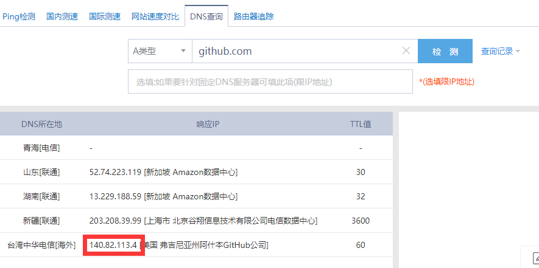
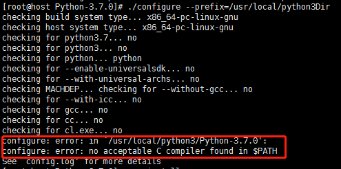
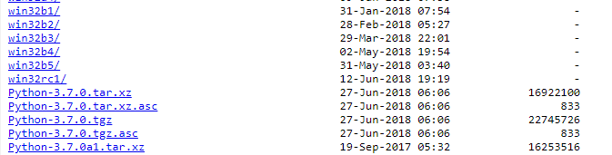

* content
{:toc}

# 服务器及shadowsocks配置  
# Ubuntu18  
- apt update
- apt install python3-pip  
- apt install vim  
- apt install shadowsocks  

安装shadowsocks后，需要配置配置json文件：  
> root@localhost:~# mkdir /etc/shadowsocks  
> root@localhost:~# vim /etc/shadowsocks/config.json  

输入以下信息：
```json
{
"server":"你的ip",
"server_port":443,
"local_port":1080,
"password":"你的密码",
"method":"aes-256-cfb",
"fast_open":false,
"workers":1
}
```
配置完json文件后，启动shadowsocks服务命令如下：
```
# 启动
sudo ssserver -c /etc/shadowsocks/config.json start
# 停止
sudo ssserver -c /etc/shadowsocks/config.json stop
# 重启
sudo ssserver -c /etc/shadowsocks/config.json restart
```
配置开机自启动：
- 打开文件rc.local  
  `vim /etc/rc.local`  
- 在最后添加一句  
  `nohup /usr/local/bin/ssserver -c /etc/shadowsocks/config.json start > /dev/null 2>&1` 
  
# 遇到的问题  
## Github访问缓慢  
参考：[GitHub访问速度慢的一种优化方法](https://baijiahao.baidu.com/s?id=1608100091125662190&wfr=spider&for=pc)  
1. 打开DNS查询网站[http://tool.chinaz.com/dns](http://tool.chinaz.com/dns)并输入github.com  
2. 点击检测，在下方的结果列表中选择TTL值小的IP地址(140.82.113.4)  
     
3. 打开本地电脑的`C:\Windows\System32\drivers\etc`目录，找到`hosts`文件并在该文件的末尾一行添加`140.82.113.4 github.com`即可  

## apt install缓慢
切换国内源，参考至[这里](https://blog.csdn.net/weixin_43960643/article/details/88425291)  
编辑文件`/etc/apt/sources.list`
```bash
# 阿里云
deb http://mirrors.aliyun.com/ubuntu/ bionic main restricted universe multiverse
deb-src http://mirrors.aliyun.com/ubuntu/ bionic main restricted universe multiverse

deb http://mirrors.aliyun.com/ubuntu/ bionic-security main restricted universe multiverse
deb-src http://mirrors.aliyun.com/ubuntu/ bionic-security main restricted universe multiverse

deb http://mirrors.aliyun.com/ubuntu/ bionic-updates main restricted universe multiverse
deb-src http://mirrors.aliyun.com/ubuntu/ bionic-updates main restricted universe multiverse

deb http://mirrors.aliyun.com/ubuntu/ bionic-proposed main restricted universe multiverse
deb-src http://mirrors.aliyun.com/ubuntu/ bionic-proposed main restricted universe multiverse

deb http://mirrors.aliyun.com/ubuntu/ bionic-backports main restricted universe multiverse
deb-src http://mirrors.aliyun.com/ubuntu/ bionic-backports main restricted universe multiverse
```

## 安装anaconda
参考：[Ubuntu安装conda](https://blog.csdn.net/fengleqi/article/details/80752751)  
- 前往[官网](https://www.anaconda.com/distribution/#download-section)查看最新linux版conda下载地址
```bash
$ mkdir anaconda
$ cd anaconda
$ wget https://repo.anaconda.com/archive/Anaconda3-2019.10-Linux-x86_64.sh
$ chmod 777 Anaconda3-2019.10-Linux-x86_64.sh
$ ./Anaconda3-2019.10-Linux-x86_64.sh
```
- 安装过程中会询问是否执行`conda init`，建议选择`yes`，将`conda`命令添加至系统路径(此时查看`~/.bashrc`即可发现，在该文件的最后多出了几行anaconda相关的命令，可见`conda init`命令是通过修改该文件来关联`conda`命令的)
- 之后重启linux或使用`source ~/.bashrc`即可在命令行使用`conda`命令
- 该方法会在用户名前面加一个括号提示当前的python环境，若不希望有该提示，可不执行`conda init`命令，手动在`~/.bashrc`的最后添加一行`export PATH=[conda安装路径]/bin:$PATH`

注意：
- 上述操作只是在当前用户目录下初始化conda命令，若切换至其他目录(如root)则会发现conda命令不可用
- 执行`[conda安装路径]/bin/conda init`并重启linux即可

## ss启动报错  
参考：[ShadowSocks启动报错undefined symbol EVP_CIPHER_CTX_cleanup](https://kionf.com/2016/12/15/errornote-ss/)  
- 打开`/usr/local/lib/python3.5/dist-packages/shadowsocks/crypto/openssl.py`  
- 替换文中`libcrypto.EVP_CIPHER_CTX_cleanup.argtypes`为`libcrypto.EVP_CIPHER_CTX_reset.argtypes`, 共两处，并保存  
- 运行ss即可

## ssserver开启后能ping通但本地使用软件无法翻墙  
参考：[搬瓦工能ping通SSH连不上](https://www.bwgyhw.cn/ssh-forbidden/)  
1. 打开[IP可用性检测工具](https://www.toolsdaquan.com/ipcheck/)  
2. 修改`shadowsocks/config.json`中`server_port`并启动`ssserver`服务  
3. 在IP可用性检测工具中填写服务器IP地址及刚开启的`server_port`，点击开始测试  
     
4. 若显示`国内检测结果：ICMP可用；TCP可用`则该端口可用，否则转到步骤2，重新修改端口再次尝试  
   注意：服务器上必须有服务监听xxx端口的情况下，查询xxx端口才会有响应，举个例子，举个例子，我的https（网站服务）运行在443端口上，测试443端口才会有响应，而测试444端口则会返回不可用的结果，因为444端口在我服务器上并没有服务监听。  
 
## 容易被墙
### 解决方法一：ssr修改加密方式
实测发现ssr上常见的加密方式并不能降低被墙的概率，建议使用较新的加密方式（需要在服务器端进行安装加密协议）。
### 解决方法二：V2ray
[网络跳跃](https://www.hijk.pw/)

# centOS  
## centOS安装python3及pip3  
### 第一步：python2备份  
`centOS的yum是基于python2.7的，将python备份为python2.7可能导致yum命令不可用，可跳过备份步骤，直接从步骤二开始。`
默认Centos7中是有python安装的，但是是2.7版本，我们需要安装py3。我们去看一下默认的py2.7在哪里。  
>[root@localhost bin]# cd /usr/bin  
>[root@localhost bin]# ls python*  
>python  python2  python2.7  
>[root@localhost bin]#  

三个显示结果中最后一个是python2.7，实际上这几个文件之间是有依赖关系的。在ls 后面加个 -al参数，如下：  

>[root@localhost bin]# ls -al  python*  
>lrwxrwxrwx. 1 root root   33 Oct 21 12:30 python -> python2  
>lrwxrwxrwx. 1 root root    9 Oct 19 23:55 python2 -> python2.7  
>-rwxr-xr-x. 1 root root 7136 Aug  4 08:40 python2.7  
>[root@localhost bin]#  

依赖关系很明显就可以看到。我们要安装版本3，首先要把刚才显示的三个python文件中的第一个python给备份一下（不保留源文件，仅保留备份文件就可以）  

使用如下命令：  

>[root@localhost bin]# mv python python.bak  

python文件变成了python.bak文件，bak文件就放这里吧，再也不用管它了。避免以后麻烦，就留在这里不用删除。系统准备好了，接下来，我们要去下载了。  

### 第二步：依赖关系  
>[root@localhost ~]#  yum update  
>[root@localhost ~]# yum -y install zlib-devel  
>[root@localhost ~]# yum -y install bzip2-devel expat-devel gdbm-devel readline-devel sqlite-devel  

参考至[这里](https://www.jianshu.com/p/6ca263642afc)和[这里](https://blog.csdn.net/zuolovefu/article/details/78142507)  

#### 遇到的问题1  
问题描述："no module named '_ctypes''"  
Python3 中有个内置模块叫 ctypes，它是 Python3 的外部函数库模块，它提供兼容 C 语言的数据类型，并通过它调用 Linux 系统下的共享库（Shared library），此模块需要使用 CentOS 7 系统中外部函数库（Foreign function library）的开发链接库（头文件和链接库）。
所以错误原因是：在 CentOS 7 系统中没有安装外部函数库（软件包名：libffi）的开发链接库软件包。
CentOS 7 系统下外部函数库（libffi）的开发链接库软件包是 libffi-devel，只要安装此软件包即可解决：参考至[这里](https://blog.csdn.net/oZhengTuoJiaSuo/article/details/82427076)  
>[root@localhost ~]# yum -y install libffi-devel

#### 遇到的问题2  
问题描述："cannot import name 'httpshandler'"  
原因在于openssl,openssl-devel两个文件包未正确安装或者安装顺序出错。
用下来的命令来安装：参考至[这里](https://www.cnblogs.com/liangmingshen/p/9515355.html)  
>[root@localhost ~]# yum install openssl -y
>[root@localhost ~]# yum install openssl-devel -y

#### 遇到的问题3  
问题描述：no acceptable C compiler found in $PATH  
  
系统路径中未找到C编译器，服务器新装的系统竟然连gcc都没有。。安装gcc：  
> [root@localhost ~]# yum install gcc


### 第三步：安装包下载

比较推荐下面这种方式，我们在linux上找一个目录，然后使用wget命令下载到这个目录，然后解压->安装。如下：  

https://www.python.org/ftp/python/   这个是所有的python版本存放的地方。我们想使用哪个版本就用哪个。  
  

很多版本，这里选择的是比较新的3.7.0，点进去，找到下面这个文件。Python-3.7.0.tgz，右键'copy link address'  
  
在Python-3.7.0.tgz上右键'copy link address'可得到如下地址：（如果是其他版本道理与这个是一样的）  

>https://www.python.org/ftp/python/3.7.0/Python-3.7.0.tgz  

链接准备好了，我们在Centos 7上创建一个目录吧。一般选择的是/usr/local里面的，如下命令（当前我们依然还在之前的/usr/bin目录下面，先不要动，还在这里）：  
>[root@localhost bin]# mkdir /usr/local/python3  

目录创建好了，我们就cd切换进去，使用wget下载安装包到当前目录：  

>[root@localhost bin]# cd /usr/local/python3
[root@localhost python3]# wget https://www.python.org/ftp/python/3.7.0/Python-3.7.0.tgz  

若未安装`wget`可通过命令：`yum install wget -y`进行安装。  
等待下载完成之后会在当前目录下出现一个tgz包，命令解压这个包到当前目录就可以：  

```
# 解压命令
[root@localhost python3]# tar -xvf Python-3.6.3.tgz 
# 解压完成后，查看目录下文件
[root@localhost python3]# ll
total 22148
drwxr-xr-x. 17  501  501     4096 Oct 21 12:22 Python-3.6.3
-rw-r--r--.  1 root root 22673115 Oct  3 15:47 Python-3.6.3.tgz
```

### 第四步：编译安装  
下载的安装包是未经过编译的，需要编译一下：  
>[root@localhost python3]# cd Python-3.6.3/  
>[root@localhost Python-3.6.3]#   

然后如下命令（指定安装位置为当前目录下新建的python3dir文件夹）：  
>[root@localhost Python-3.6.3]# ./configure --prefix=/usr/local/python3Dir  

稍微解释上面这句命令，这句话的大致目的就是把python的安装目录指定一下，这样的话，里面的一些bin目录、lib目录就都会存放在这个目录下面。如果不指定这个安装目录的话，最后python的安装文件将分散到linux的默认目录，不在一块。我们指定安装目录，以后卸载的话直接删除目录就可以干净卸载了。  


```
# 编译安装
# ./configure --help查看编译参数
# 默认安装在'/usr/local/bin','/usr/local/lib' etc
# 可以通过参数指定如：--prefix=/usr/local/python3
```
现在我们当前目录还是在/usr/local/python3/Python-3.6.3，执行如下命令：  
>[root@localhost Python-3.6.3]# make  

然后出来一大堆代码，等它执行完毕。接着输入以下命令：  

>[root@localhost Python-3.6.3]# make install  

又是一大堆代码，执行完毕之后，检查pip和setuptools是否安装成功。  
我们可以切换到/usr/local/python3dir目录下去查看了。  

>[root@localhost Python-3.6.3]# cd /usr/local/python3Dir/  
>[root@localhost python3Dir]# ll  
>total 0  
>drwxr-xr-x. 2 root root 245 Oct 21 12:26 bin  
>drwxr-xr-x. 3 root root  24 Oct 21 12:26 include  
>drwxr-xr-x. 4 root root  63 Oct 21 12:26 lib  
>drwxr-xr-x. 3 root root  17 Oct 21 12:26 share  
>[root@localhost python3Dir]#   

### 第五步：创建软连接/修改PATH  
#### 创建软连接  
>[root@localhost python3Dir]# cd /usr/bin  
>//创建软连接：  
>[root@localhost bin]# ln -s /usr/local/python3Dir/bin/python3 /usr/bin/python3  //根据需要可修改为python  
>[root@localhost bin]# ln -s /usr/local/python3Dir/bin/pip3 /usr/bin/pip3  

若将python3软连接设置为python：  
要注意centos的yum命令是需要python支持的，我们贸然把当期的版本更换了，万一yum出错怎么办，还是让yum依然用原来的2.7版本吧。好吧我们帮它改一下吧：  
>[root@localhost bin]# vim /usr/bin/yum  

将文件第一行的
`#!/usr/bin/python`改成`#!/usr/bin/python2.7`  
>[root@localhost bin]# vim /usr/libexec/urlgrabber-ext-down  

将`/usr/bin/python`改为`/usr/bin/python2.7`  

>[root@localhost bin]# vim /usr/bin/yum-config-manager  

解决办法同上： `#!/usr/bin/python`换成 `#!/usr/bin/python2.7`    

参考至[这里](https://blog.csdn.net/chaojiwanwan/article/details/71439066)  

#### 修改环境变量PATH  
修改`/etc/profile`文件使其永久性生效，并对所有系统用户生效，在文件末尾加上如下两行代码  
`PATH=$PATH:/usr/local/python3Dir/bin`  
`export PATH`  
最后：执行 命令`source /etc/profile`或 执行点命令 `./profile`使其修改生效，执行完可通过`echo $PATH`命令查看是否添加成功。  

### 测试python3及pip3：  
>[root@localhost bin]# python3 -V  
>Python 3.7.0  
>[root@localhost bin]# pip3 -V  
>pip 10.0.1 from /usr/local/python3Dir/lib/python3.7/site-packages/pip (python 3.7)  

### 备注  
在配置`./configure --prefix=/usr/local/python3Dir`后，pip安装的包路径将改变。  
通过pip3安装的package路径：  
`/usr/local/python3Dir/lib/python3.7/site-packages/`  
执行命令：  
`/usr/local/python3Dir/bin/`  

参考至[这里](https://www.cnblogs.com/simuhunluo/p/7704765.html)

## 独立安装pip3  
### 安装setuptools  
- 下载setuptools压缩包  
- 解压压缩包  
- 进入该目录进行编译安装  

```
1. 下载setuptools  wget --no-check-certificate  https://pypi.python.org/packages/source/s/setuptools/setuptools-19.6.tar.gz#md5=c607dd118eae682c44ed146367a17e26

36.6.0的直接下载地址：
wget --no-check-certificate 
 https://pypi.python.org/packages/45/29/8814bf414e7cd1031e1a3c8a4169218376e284ea2553cc0822a6ea1c2d78/setuptools-36.6.0.zip#md5=74663b15117d9a2cc5295d76011e6fd1


2. 解压该文件 tar zxvf setuptools-19.6.tar.gz

3.进入该目录 cd setuptools-19.6

4. 编译安装
 python3.5 setup.py build  
在这里失败，提示说需要zlib-devel依赖，RuntimeError: Compression requires the (missing) zlib module

好吧，那就继续安装这个依赖即可,yum在手，天下我有，有木有。
yum install -y zlib-devel

但是现在不能直接执行上一条编译命令，因为这个zlib其实是针对python的，所以我们需要对python再进行一次编译和安装命令。
就是上文中所使用的make&make install即可。

ok，完事儿之后在执行
 python3.5 setup.py build   无报错信息
继续执行
python3.5 setup.py install  搞完。

```

### 安装pip3  
- 下载pip3压缩包
- 解压压缩包
- 进入该目录进行编译安装

```
1. 使用Linux下载文件 wget --no-check-certificate  https://pypi.python.org/packages/source/p/pip/pip-8.0.2.tar.gz#md5=3a73c4188f8dbad6a1e6f6d44d117eeb

pip-9.0.1的下载地址：https://pypi.python.org/packages/11/b6/abcb525026a4be042b486df43905d6893fb04f05aac21c32c638e939e447/pip-9.0.1.tar.gz#md5=35f01da33009719497f01a4ba69d63c9

2. 解压文件  tar zxvf pip-8.0.2.tar.gz

3. 进入该目录 cd pip-8.0.2 

4. 同样执行：
  python3.5 setup.py build
  python3.5 setup.py install

没有提示错误，那么就安装成功了。

安装好了之后会在我们的python目录中成成该执行文件的。
Adding pip 8.0.2 to easy-install.pth file
Installing pip3.5 script to /usr/local/python/bin
Installing pip3 script to /usr/local/python/bin
Installing pip script to /usr/local/python/bin

这个就是安装是的提示，给我们说的很清楚，说将pip3安装到了/usr/local/python/bin目录中

对于我此时的目录就是：
  /usr/local/python/bin
```

## 卸载python3  
由于我们在安装python3的时候将其安装位置指定到`/usr/local/python3Dir/`目录中，故我们可直接删除该目录将python3卸载干净：  
>[root@localhost ~]# rm -rf /usr/local/python3Dir/  
>别忘了创建的软连接：  
>[root@localhost bin]# rm /usr/bin/python3  
>[root@localhost bin]# rm /usr/bin/pip3  

# 附  
## 安装并配置vim  
参考至[一个小博客教你把vim用飞起来](https://www.cnblogs.com/songfy/p/5635757.html)  
>[root@host ~]# apt update  
>[root@host ~]# apt install vim  
>[root@host ~]# vim ~/.vimrc  

并将以下内容复制进去：
```
set modelines=0

"设置更好的删除
set backspace=2

syntax on "语法高亮

"用浅色高亮当前行
autocmd InsertLeave * se nocul
autocmd InsertEnter * se cul

set smartindent "智能对齐

set autoindent "自动对齐

set confirm "在处理未保存或只读文件的时候，弹出确认框

set tabstop=4 "tab键的宽度
set softtabstop=4
set shiftwidth=4 "统一缩进为4
set expandtab "不要用空格替代制表符

set number "显示行号
set history=50  "历史纪录数
set hlsearch
set incsearch "搜素高亮,搜索逐渐高亮

set gdefault "行内替换
set encoding=utf-8
set fileencodings=utf-8,ucs-bom,shift-jis,gb18030,gbk,gb2312,cp936,utf-16,big5,euc-jp,latin1 "编码设置

set guifont=Menlo:h16:cANSI "设置字体
set langmenu=zn_CN.UTF-8
set helplang=cn  "语言设置

set ruler "在编辑过程中，在右下角显示光标位置的状态行

set laststatus=1  "总是显示状态行

set showcmd "在状态行显示目前所执行的命令，未完成的指令片段也会显示出来

set scrolloff=3 "光标移动到buffer的顶部和底部时保持3行的距离
set showmatch "高亮显示对应的括号
set matchtime=5 "对应括号高亮时间(单位是十分之一秒)

set autowrite "在切换buffer时自动保存当前文件

set wildmenu  "增强模式中的命令行自动完成操作

set linespace=2 "字符间插入的像素行数目
set whichwrap=b,s,<,>,[,] "开启normal 或visual模式下的backspace键空格键，左右方向键,insert或replace模式下的左方向键，右方向键的跳行功能

filetype plugin indent on "分为三部分命令:file on,file plugin on,file indent on 分别是自动识别文件类型, 用用文件类型脚本,使用缩进定义文件

set foldenable  "允许折叠
set cursorline "突出显示当前行
set magic  "设置魔术？神马东东
set ignorecase "搜索忽略大小写
filetype on "打开文件类型检测功能
set background=dark
set t_Co=256   "256色
set mouse=a  "允许鼠标
```

## 安装并配置shadowsocks  
我这里已经安装过shadowsocks，可以看到其安装目录为`/usr/local/python3Dir/lib/python3.7/site-packages`，下面，我们进入该目录并配置json文件：  
>[root@host ~]# pip install shadowsocks  
>[root@host ~]# cd /usr/local/python3Dir/lib/python3.7/site-packages/shadowsocks  
>[root@host shadowsocks]# vim config.json  

输入以下信息：
```json
{
"server":"你的ip",
"server_port":443,
"local_port":1080,
"password":"你的密码",
"method":"aes-256-cfb",
"fast_open":false,
"workers":1
}
```

`config.json`文件配置完成后，启动命令如下：  
>[root@host shadowsocks]# nohup ssserver -c /usr/local/python3Dir/lib/python3.7/site-packages/shadowsocks/config.json start > /dev/null 2>&1 &  

关于如何配置开启自启动，参照我的另一篇博客：https://blog.csdn.net/qq_36297936/article/details/86703688  
