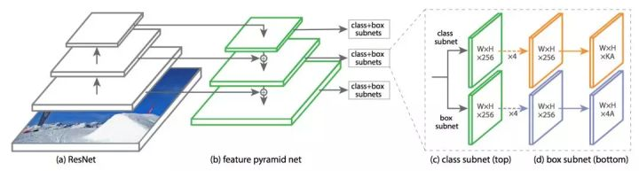
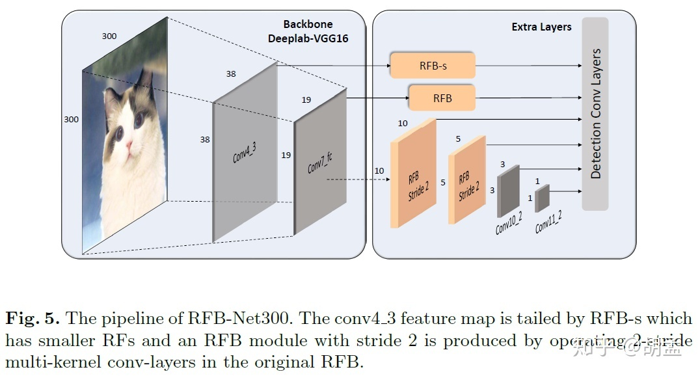
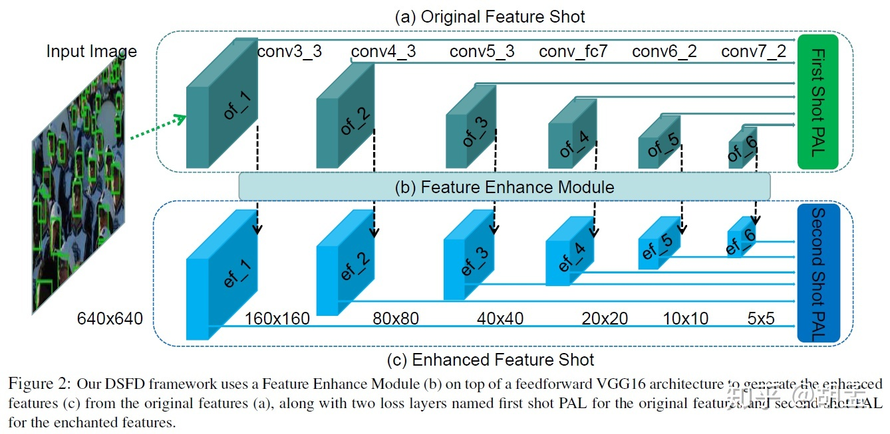
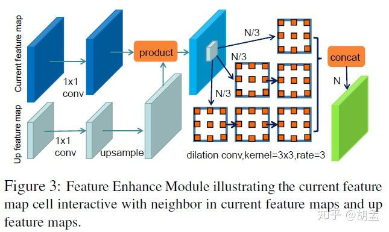

# Object Detection

- [Object Detection](#object-detection)
  - [发展](#%E5%8F%91%E5%B1%95)
  - [R-CNN](#r-cnn)
  - [SPP Net](#spp-net)
  - [Fast R-CNN](#fast-r-cnn)
  - [Faster R-CNN](#faster-r-cnn)
  - [YoloV1](#yolov1)
  - [SSD(Single Shot MultiBox Detector)](#ssdsingle-shot-multibox-detector)
  - [R-FCN](#r-fcn)
  - [FPN(Feature Pyramid Networks)](#fpnfeature-pyramid-networks)
  - [YoloV2](#yolov2)
  - [RetinaNet](#retinanet)
    - [Focal loss](#focal-loss)
  - [Mask R-CNN](#mask-r-cnn)
    - [ROI Align](#roi-align)
    - [损失函数](#%E6%8D%9F%E5%A4%B1%E5%87%BD%E6%95%B0)
  - [YoloV3](#yolov3)
  - [RFBNet(Receptive Fields Block)](#rfbnetreceptive-fields-block)
  - [DSFD(Dual Shot Face Detector)](#dsfddual-shot-face-detector)

## 发展
物体检测（Object Detection）的任务是找出图像或视频中的感兴趣目标，同时实现输出检测目标的位置和类别，是机器视觉领域的核心问题之一，学术界已有将近二十年的研究历史。随着深度学习技术的火热发展，目标检测算法也从基于手工特征的传统算法转向了基于深度神经网络的检测技术。从最初2013年提出的R-CNN、OverFeat，到后面的 Fast/Faster R-CNN、SSD、YOLO 系列，以及Mask R-CNN、RefineDet、RFBNet等。短短不到五年时间，基于深度学习的目标检测技术，在网络结构上，从 two stage 到 one stage，从 bottom-up only 到 Top-Down，从 single scale network 到 feature pyramid network，从面向 PC 端到面向移动端，都涌现出许多好的算法技术，这些算法在开放目标检测数据集上的检测效果和性能都很出色。

物体检测过程中有很多不确定因素，如图像中物体数量不确定，物体有不同的外观、形状、姿态，加之物体成像时会有光照、遮挡等因素的干扰，导致检测算法有一定的难度。进入深度学习时代以来，物体检测发展主要集中在两个方向：two stage算法如R-CNN系列和one stage算法如YOLO、SSD等。两者的主要区别在于two stage算法需要先生成proposal（一个有可能包含待检物体的预选框），然后进行细粒度的物体检测。而one stage算法会直接在网络中提取特征来预测物体分类和位置。

## R-CNN
预先找出图中目标可能出现的位置，即候选区域（Region Proposal）。利用图像中的纹理、边缘、颜色等信息，可以保证在选取较少窗口(几千甚至几百）的情况下保持较高的召回率（Recall）。

候选框的性能对比如下：

2014年，RBG（Ross B. Girshick）使用Region Proposal + CNN代替传统目标检测使用的滑动窗口+手工设计特征，设计了R-CNN框架，使得目标检测取得巨大突破，并开启了基于深度学习目标检测的热潮。

R-CNN步骤如下：
1. 输入测试图像
2. 利用选择性搜索Selective Search算法在图像中从下到上提取2000个左右的可能包含物体的候选区域Region Proposal
3. 因为取出的区域大小各自不同，所以需要将每个Region Proposal缩放（warp）成统一的227x227的大小并输入到CNN，将CNN的fc7层的输出作为特征
4. 将每个Region Proposal提取到的CNN特征输入到SVM进行分类（注意：使用的SVM进行二分类，所以多分类时需要多个SVM分类器进行分别判断）
5. 使用回归器精修候选框位置

## SPP Net
SPP: Spatial Pyramid Pooling（空间金字塔池化）

卷积层不需要固定输入尺寸，但全连接层需要固定输入，所以当全连接层面对各种输入时，就需要对数据进行crop或者warp，但warp/crop这种预处理，导致的问题要么被拉伸变形、要么物体不全，限制了识别精确度。

SPP Net的作者Kaiming He等人逆向思考，既然由于全连接FC层的存在，普通的CNN需要通过固定输入图片的大小来使得全连接层的输入固定。那借鉴卷积层可以适应任何尺寸，为何不能在卷积层的最后加入某种结构，使得后面全连接层得到的输入变成固定的呢？下图便是R-CNN和SPP Net检测流程的比较：

SPP Net有两个特点:
1. 结合空间金字塔实现CNN的多尺度输入
2. 只对原图提取一次卷积特征

只对原图进行一次卷积计算，便得到整张图的卷积特征feature map，然后找到每个候选框在feature map上的映射patch，将此patch作为每个候选框的卷积特征输入到SPP layer和之后的层，完成特征提取工作。

## Fast R-CNN
和R-CNN主要有两点不同：

1. 借鉴SPP Net的思想，只进行一次特征提取，后面连接ROI池化层
2. 使用了多分类损失（softmax），将边框回归直接加入到网络中进行训练

一点说明：ROI pooling layer实际上是SPP-NET的一个精简版，SPP-NET对每个proposal使用了不同大小的金字塔映射，而ROI pooling layer只需要下采样到一个7x7的特征图。对于VGG16网络conv5_3有512个特征图，这样所有region proposal对应了一个7 * 7 * 512维度的特征向量作为全连接层的输入。

特点：

R-CNN：许多候选框（比如两千个分别）-->CNN-->得到每个候选框的特征-->分类+回归

Fast R-CNN：一张完整图片-->CNN-->得到每张候选框的特征（分别）-->分类+回归

## Faster R-CNN
Fast R-CNN存在的问题：选择性搜索，找出所有的候选框，这个也非常耗时，Fast R-CNN中引入Region Proposal Network(RPN)替代Selective Search，同时引入anchor box应对目标形状的变化问题（anchor就是位置和大小固定的box，可以理解成事先设置好的固定的proposal）。

一种网络，四个损失函数;
* RPN calssification(anchor good.bad)
* RPN regression(anchor->propoasal)
* Fast R-CNN classification(over classes)
* Fast R-CNN regression(proposal ->box)

RPN简介：
* 在feature map上滑动窗口
* 建一个神经网络用于物体分类+框位置的回归
* 滑动窗口的位置提供了物体的大体位置信息
* 框的回归提供了框更精确的位置

## YoloV1
YOLO检测流程图如下：

1. 给个一个输入图像，首先将图像划分成7*7的网格
2. 对于每个网格，我们都预测2个边框（包括每个边框是目标的置信度以及每个边框区域在多个类别上的概率）
3. 根据上一步可以预测出$7*7*2$个目标窗口，然后根据阈值去除可能性比较低的目标窗口，最后NMS去除冗余窗口即可

## SSD(Single Shot MultiBox Detector)
yolov1使用整图特征在7*7的粗糙网格内回归对目标的定位并不是很精准,SSD结合anchor进行了改进

假如某一层特征图(图b)大小是$8*8$，那么就使用$3*3$的滑窗提取每个位置的特征，然后这个特征回归得到目标的坐标信息和类别信息(图c)。

不同于Faster R-CNN，这个anchor是在多个feature map上，这样可以利用多层的特征并且自然的达到多尺度（不同层的feature map 3*3滑窗感受野不同）。

SSD会基于多个特征映射进行检测。但是低层并不用于目标检测，原因是这些层的分辨率虽然很高，但语义不够强，因此，为了避免显著的速度下降，目标检测时不使用这些层。因为SSD检测时仅使用高层，所以在小目标上的表现要差很多。它的结构如下图所示。

## R-FCN
R-FCN网络结构如下：

* position-sensitive score map

如果一个RoI含有一个类别c的物体，那么将该RoI划分为 $k\times k$ 个区域，分别表示该物体的各个部位，比如假设该RoI中含有人这个物体，k=3，那么就将“人”划分为了9个子区域，top-center区域毫无疑问应该是人的头部，而bottom-center应该是人的脚部，而将RoI划分为 $k\times k$ 个区域是希望这个RoI在其中的每一个区域都应该含有该类别c的物体的各个部位，即如果是人，那么RoI的top-center区域就必须含有人的头部。而当这所有子区域都含有各自对应的该物体的相应部位后，那么分类器才会将该RoI判断为该类别。物体的各个部位和RoI的这些子区域是“一一映射”的对应关系。

现在的任务就是“判断RoI子区域是否含有物体的相应部位”。这就是position-sensitive score map设计的核心思想了。R-FCN会在共享卷积层的最后再接上一层卷积层，而该卷积层就是“位置敏感得分图position-sensitive score map”，该score map是什么意义呢？首先它就是一层卷积层，它的height和width和共享卷积层的一样，但是它的channels= $k^{2}(C+1)$ ，如上图所示。那么C表示物体类别种数再加上1个背景类别，每个类别都有 $k^{2}$个score maps。现在我们先只针对其中的一个类别来讨论，假设是人这个类别，那么其有 $k^{2}$ 个score maps，每一个score map表示“原图image中的哪些位置含有人的某个一个部位”，而该score map会在含有“该score map对应的人体的某个部位”的位置有“高响应值”，也就是说每一个score map都是用来“描述人体的其中一个部位出现在该score map的何处，而在出现的地方就有高响应值”。那么好了既然是这样，那么我们只要将RoI的各个子区域对应到“属于人的每一个score map”上然后获取它的响应值不就好了。对，就是这样。但是要注意，由于一各score map都是只属于“一个类别的一个部位”的，所以RoI的第 i 个子区域一定要到第 i 张score map上去找对应区域的响应值，因为RoI的第 i 的子区域需要的部位和第 i 张score map关注的部位是一样的，所以就是这样的对应关系。那么现在该RoI的 $k\times k$ 个子区域都已经分别到“属于人的 $k^{2}$ 个score maps”上找到其响应值了，那么如果这些响应值都很高，那么就证明该RoI是人。

* Position-sensitive RoI pooling

通过RPN提取出来的RoI区域，其是包含了“坐标、长宽”的4值属性的，也就是说不同的RoI区域能够对应到score map的不同位置上，而一个RoI会分成 $k\times k$ 个bins（也就是子区域。每个子区域bin的长宽分别是 $\frac{h}{k}$ 和 $\frac{w}{k}$ ），每个bin都对应到score map上的某一个区域。既然该RoI的每个bin都对应到score map上的某一个子区域，那么池化操作就是在该bin对应的score map上的子区域执行，且执行的是平均池化。我们在上一部分已经讲了，第 i 个bin应对在第 i 个score map上找响应值，那么也就是在第 i 个score map上的“该第 i 个bin对应的位置”上进行池化操作，且池化是取“bin这个范围内的所有值的平均值”。并且由于有 C+1 个类别，所以每个类别都要进行相同方式的池化。

对于每个类别，它都有 $k^{2}$ 个score maps，那么按照上述的池化方式，可以RoI针对该类别可以得到 $k^{2}$ 个值，那么一共有 $C+1$ 个类别，那么一个RoI就得到 $k^{2}(C+1)$ 个值，就是上图的“channels= $C+1$ ，size= $k\times k$ ”的特征图。那么对于每个类别，该类别的 $k^{2}$ 个值都表示该RoI属于该类别的响应值，那么将这 $k^{2}$ 个数相加就得到该类别的score，那么一共有 $C+1$ 个scores，那么将这 $C+1$ 个数使用简单的softmax函数就可以得到属于各个类别的概率了。

## FPN(Feature Pyramid Networks)
由于检测不同尺度的目标（尤其是小目标）比较困难，引入金字塔技术

目前主流检测框架有4种使用特征的形式：

1. 图像金字塔。即将图像缩放到不同的大小，然后不同大小的图像生成对应的特征。这种方法的缺点是增加了时间成本。有些算法会在检测时采用这种图像金字塔的方案。

2. 单一尺度特征层。SPPNet，Fast RCNN，Faster RCNN采用这种方式，即仅采用网络最后一层卷积层的特征。

3. SSD采用这种多尺度特征融合的方式，但是没有上采样过程，即从网络不同层抽取不同尺度的特征做预测，这种方式不会增加额外的计算量。SSD算法中没有用到足够低层的特征（在SSD中，最低层的特征是VGG网络的conv4_3），而足够低层的特征对于检测小物体是很有帮助的。

4. FPN采用bottom-up与top-down的结构，实现了低层特征和高层语义特征的融合，提高了特征映射的信息密度和分辨率，提高了小目标物体的检测效果；区别于SSD，FPN每层都是独立预测的。

## YoloV2
* yolov2改进了yolov1的网络结构，加入了BN和resnet结构
* 借鉴了Faster-rcnn中Anchor的思想
* 没有直接预测offset，而使用了预测相对于grid cell的坐标位置的办法，利用logistic函数把ground truth归一化到0到1之间，坐标值被归一化后，模型优化会更稳定。

## RetinaNet
RetinaNet结合了FPN、ResNet、FocalLoss，网络结构如下：

### Focal loss
Focal Loss的作用是为了解决类别不平衡问题（背景类比较多），因此只要该模型能够很好地检测背景，就可以减少其损失并重新增强对目标类的训练。下面公式和图为CE和FL的对比：
$$
\begin{aligned}
CE(p_t) &= -\log(p_t) \\
FL(p_t) &= -(1-p_t)^{\gamma}\log(p_t)
\end{aligned}
$$

## Mask R-CNN
Mask R-CNN结构如下

Mask R-CNN基于Faster R-CNN，首先是使用RPN(可以加上FPN)得到候选区域(RoI)，然后使用RoI Pooling的技术（实际使用中RoI Pool层变成一个RoI Align层）把这些区域的特征变成固定大小。Faster R-CNN在RoI Pooling后的特征上加上一些全连接层然后分类和bounding box回归。而Mask R-CNN在此基础上再加了一些卷积网络层用来判断某个候选区域的每一个像素是否属于这个目标物体，如下图所示。这个卷积网络层的输入是特征映射，输出是一个和RoI一样大小的矩阵。值为1表示模型预测这个像素属于目标物体，0则不属于。
### ROI Align
Mask R-CNN的想法非常简单，是Faster R-CNN的自然推广。但是RoI Pooling在用于实例分割时会有比较大的偏差，原因在于Region Proposal和RoI Pooling都存在量化的舍入误差。ROI Pooling这一操作存在两次量化的过程：

* 将候选区域量化为整数点坐标值
* 将量化后的区域分割成 k x k 个单元(bin)，不能整除时也需要量化

经过上述两次量化，此时的候选区域已经和最开始回归出来的位置有一定的偏差，这个偏差会影响检测和分割的准确度。在论文里，作者把它叫作“不匹配问题（misalignment）。

我们用一个的例子具体分析一下不匹配问题。如下图所示，这是使用Faster-RCNN来实现目标检测。输入是800x800的图片，图片上有一个665*665的候选区域(里面是一只狗)。图片经过主干网络(backbone)进行提取特征后，特征映射的步长（stride）为32。因此，图像和候选区域的长度都是输入的1/32。800正好可以被32整除变为25。但665除以32以后得到20.78，有小数，于是ROI Pooling 把它量化成20。接下来需要把20x20的输入通过RoI Pooling变成7x7的大小，因此将上述包围框平均分割成7x7个矩形区域。显然，每个矩形区域的边长为2.86，又含有小数。于是ROI Pooling 再次把它量化到2。经过这两次量化，候选区域已经出现了较明显的偏差（如图中绿色部分所示）。更重要的是，该层特征映射上0.1个像素的偏差，缩放到原图就是3.2个像素。那么0.8的偏差，在原图上就是接近30个像素点的差别，这一差别是非常巨大的。

为了解决ROI Pooling的上述缺点，作者提出了ROI Align这一改进的方法(如下图所示)。ROI Align的思路很简单：取消量化操作，使用双线性内插的方法获得坐标为浮点数的像素点上的图像数值,从而将整个特征聚集过程转化为一个连续的操作。值得注意的是，在具体的算法操作上，ROI Align并不是简单地补充出候选区域边界上的坐标点，然后将这些坐标点进行池化，而是重新设计了一套优雅的流程，如下图所示。流程为：

* 遍历每一个候选区域，保持浮点数边界不做量化
* 将候选区域分割成k x k个单元，每个单元的边界也不做量化。
* 在每个单元中计算固定四个坐标位置，用双线性内插的方法计算出这四个位置的值，然后进行最大池化操作。

这里对上述步骤的第三点作一些说明：这个固定位置是指在每一个矩形单元（bin）中按照固定规则确定的位置。比如，如果采样点数是1，那么就是这个单元的中心点。如果采样点数是4，那么就是把这个单元平均分割成四个小方块以后它们分别的中心点。显然这些采样点的坐标通常是浮点数，所以需要使用插值的方法得到它的像素值。在相关实验中，作者发现将采样点设为4会获得最佳性能，甚至直接设为1在性能上也相差无几。事实上，RoI Align 在遍历取样点的数量上没有RoI Pooling那么多，但却可以获得更好的性能，这主要归功于解决了misalignment的问题。实验时发现，ROI Align在VOC2007数据集上的提升效果并不如在COCO上明显。造成这种区别的原因是COCO上小目标的数量更多，而小目标受misalignment问题的影响更大。

再来分析一下RoI Align的思路，其实很简单：候选区域进行缩放时并不进行量化。这似乎有点问题——我们怎么得到这个区域某个点的值呢？答案是不需要，因为我们并不需要得到图中狗嘴巴(假设它不是整除的点)的特征值(当然一定需要也可以通过双线性插值得到)。接下来比如我们要把这个候选区域对于的特征区域(20.78x20.78)切分成7x7，那么我们得到的更小区域是2.97x2.97。我们需要的是对这个这个更小区域进行max pooling。假设我们要进行2x2的max pooling，那么我们就可以把这个2.97x2.97的区域再切分成一个2x2的4个方框，然后对这4个方框的中心点求max pooling。现在问题来了，这个4个中心点的坐标可能不是整数。那么怎么办呢？在25x25的特征映射里找离它最近的4个点，然后进行双线性插值来估计这个点的值。

上图演示了插值过程，图中特征映射是6x6(注意图中的“格子”是5x5，但是每个点表示一个特征映射的中心，这和我们经常的习惯有些不同)，候选区域的位置被精确的定位在特征映射图中，并且精确的切分成2x2(RoI Align的输出是2x2)，接着这2x2的每个方格都被再切分成4各部分，每个部分的中心点用蓝色的点表示。每个方格都是求这4个中心点的最大值(max pooling)，现在我们需要求每个蓝点的值，这可以通过双线性插值来实现，图中展示了最坐上的一个蓝点是怎么求值的——在6x6的特征映射中找到离它最近的4个(图中红线表示)，然后用双线性插值求蓝点的值。

### 损失函数
Mask R-CNN的损失函数为：
$$ 𝐿=𝐿_{cls}+𝐿_{𝑏𝑜𝑥}+𝐿_{𝑚𝑎𝑠𝑘} $$
其中$𝐿_{𝑐𝑙𝑠}$和$𝐿_{𝑏𝑜𝑥}$是分类和Bounding box回归的损失，这和Faster R-CNN一样，这里增加了一个$𝐿_{𝑚𝑎𝑠𝑘}$。对于每个RoI，mask分支会输出$𝐾𝑚^2$个值，分别代表K个分类每一个像素的mask。注意这里对于每个候选区域，都会输出$K$个$𝑚^2$的Mask矩阵，这样每类物体的mask是独立预测的。在计算loss的时候如果物体是第$k$类物体，那么只有对于它的那$𝑚^2$个mask是计入loss的。

## YoloV3
* 多尺度预测（FPN思想）
* 更好的backbone（darknet53）
* 分类损失采用binary cross-entropy损失函数替换Softmax损失函数（Softmax会选择分数最高的类别判定为当前框所属的类别，而现实中一个目标可能属于多个类别标签）

## RFBNet(Receptive Fields Block)
现有主流的目标检测器一般两条路子：
1. 使用强有力的主干网（如ResNet-101、Inception）提取高判别性的特征，但计算开销大，运行速度慢；
2. 使用轻量级的主干网（如MobileNet），运行速度快，但性能就弱一点；

本文提出RFB，RFB模拟人类感受野，于是加入了空洞卷积（dilated convolution），并将RFB集成至SSD，形成RFBNet；通过设计的RFB模块，即使在轻量级主干网上也能提取到高判别性特征，最终RFBNet速度快，性能好；RFB模块及具体结构（使用了最新的Inception结构：Inception V4、Inception-ResNet V2）如下：

RFBNet网络如下：

## DSFD(Dual Shot Face Detector)
网络结构如下：

其中，特征增强模块如下（用到了RFB思想）：

